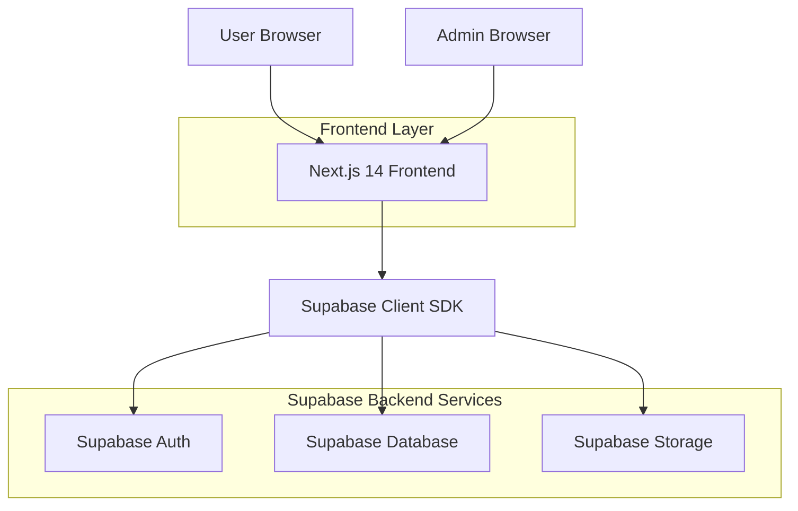
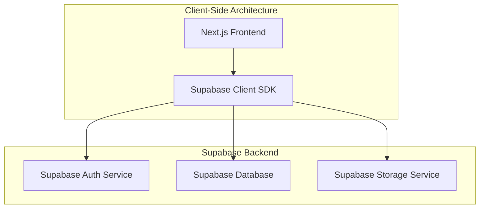
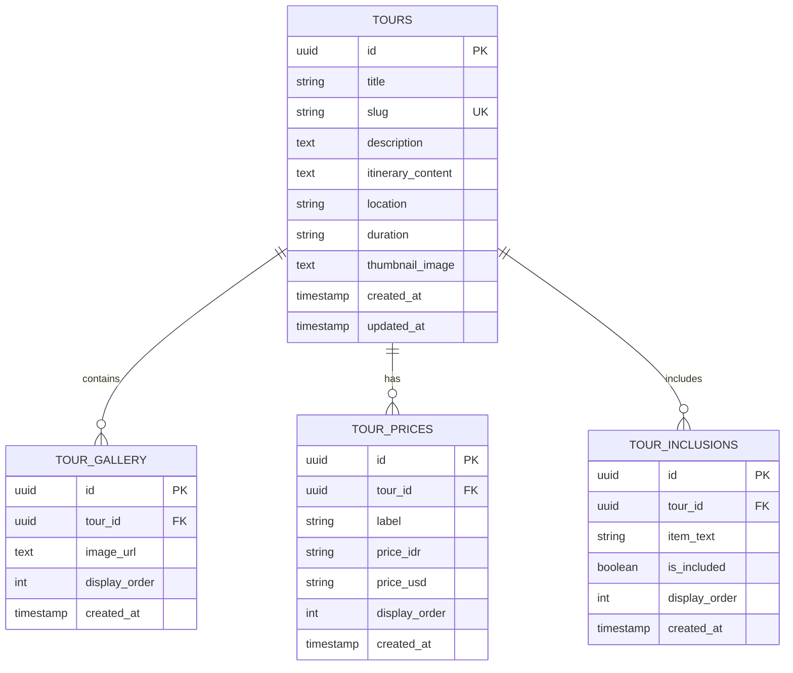

## 1. Architecture design



## 2. Technology Description

- **Frontend**: Next.js 14 + React 18 + Tailwind CSS + Lucide React
- **Initialization Tool**: create-next-app
- **Backend**: Supabase (Authentication, PostgreSQL Database, Storage)
- **Database**: Supabase PostgreSQL
- **Storage**: Supabase Storage for tour images

## 3. Route definitions

| Route | Purpose |
|-------|---------|
| `/tour/[slug]` | Public tour detail page with gallery, pricing, and WhatsApp booking |
| `/admin` | Admin dashboard login page |
| `/admin/dashboard` | Main admin dashboard for tour management |
| `/admin/tours/new` | Create new tour form |
| `/admin/tours/[id]/edit` | Edit existing tour form |

## 4. API definitions

### 4.1 Supabase Database Operations

**Tour Management**
```typescript
// Fetch tour by slug
const { data: tour } = await supabase
  .from('tours')
  .select(`
    *,
    tour_gallery(*),
    tour_prices(*),
    tour_inclusions(*)
  `)
  .eq('slug', slug)
  .single()

// Create new tour
const { data: newTour } = await supabase
  .from('tours')
  .insert({
    title: string,
    slug: string,
    description: string,
    itinerary_content: string,
    location: string,
    duration: string,
    thumbnail_image: string
  })
  .select()
  .single()
```

**Image Upload**
```typescript
// Upload to Supabase Storage
const { data, error } = await supabase.storage
  .from('tours')
  .upload(`${tourId}/${filename}`, file)

// Get public URL
const { data: { publicUrl } } = supabase.storage
  .from('tours')
  .getPublicUrl(`${tourId}/${filename}`)
```

## 5. Server architecture diagram



## 6. Data model

### 6.1 Data model definition



### 6.2 Data Definition Language

**Tours Table**
```sql
-- Create tours table
CREATE TABLE tours (
    id UUID PRIMARY KEY DEFAULT gen_random_uuid(),
    title VARCHAR(255) NOT NULL,
    slug VARCHAR(255) UNIQUE NOT NULL,
    description TEXT NOT NULL,
    itinerary_content TEXT NOT NULL,
    location VARCHAR(255) NOT NULL,
    duration VARCHAR(100) NOT NULL,
    thumbnail_image TEXT NOT NULL,
    created_at TIMESTAMP WITH TIME ZONE DEFAULT NOW(),
    updated_at TIMESTAMP WITH TIME ZONE DEFAULT NOW()
);

-- Create indexes
CREATE INDEX idx_tours_slug ON tours(slug);
CREATE INDEX idx_tours_location ON tours(location);
```

**Tour Gallery Table**
```sql
-- Create tour_gallery table
CREATE TABLE tour_gallery (
    id UUID PRIMARY KEY DEFAULT gen_random_uuid(),
    tour_id UUID NOT NULL REFERENCES tours(id) ON DELETE CASCADE,
    image_url TEXT NOT NULL,
    display_order INTEGER DEFAULT 0,
    created_at TIMESTAMP WITH TIME ZONE DEFAULT NOW()
);

-- Create index
CREATE INDEX idx_tour_gallery_tour_id ON tour_gallery(tour_id);
```

**Tour Prices Table**
```sql
-- Create tour_prices table
CREATE TABLE tour_prices (
    id UUID PRIMARY KEY DEFAULT gen_random_uuid(),
    tour_id UUID NOT NULL REFERENCES tours(id) ON DELETE CASCADE,
    label VARCHAR(100) NOT NULL,
    price_idr VARCHAR(50) NOT NULL,
    price_usd VARCHAR(50) NOT NULL,
    display_order INTEGER DEFAULT 0,
    created_at TIMESTAMP WITH TIME ZONE DEFAULT NOW()
);

-- Create index
CREATE INDEX idx_tour_prices_tour_id ON tour_prices(tour_id);
```

**Tour Inclusions Table**
```sql
-- Create tour_inclusions table
CREATE TABLE tour_inclusions (
    id UUID PRIMARY KEY DEFAULT gen_random_uuid(),
    tour_id UUID NOT NULL REFERENCES tours(id) ON DELETE CASCADE,
    item_text VARCHAR(255) NOT NULL,
    is_included BOOLEAN NOT NULL DEFAULT true,
    display_order INTEGER DEFAULT 0,
    created_at TIMESTAMP WITH TIME ZONE DEFAULT NOW()
);

-- Create index
CREATE INDEX idx_tour_inclusions_tour_id ON tour_inclusions(tour_id);
```

**Row Level Security (RLS) Policies**
```sql
-- Enable RLS
ALTER TABLE tours ENABLE ROW LEVEL SECURITY;
ALTER TABLE tour_gallery ENABLE ROW LEVEL SECURITY;
ALTER TABLE tour_prices ENABLE ROW LEVEL SECURITY;
ALTER TABLE tour_inclusions ENABLE ROW LEVEL SECURITY;

-- Grant permissions
GRANT SELECT ON tours TO anon;
GRANT SELECT ON tour_gallery TO anon;
GRANT SELECT ON tour_prices TO anon;
GRANT SELECT ON tour_inclusions TO anon;

GRANT ALL ON tours TO authenticated;
GRANT ALL ON tour_gallery TO authenticated;
GRANT ALL ON tour_prices TO authenticated;
GRANT ALL ON tour_inclusions TO authenticated;

-- Create policies for public access
CREATE POLICY "Public tours are viewable by everyone" ON tours FOR SELECT USING (true);
CREATE POLICY "Public gallery is viewable by everyone" ON tour_gallery FOR SELECT USING (true);
CREATE POLICY "Public prices are viewable by everyone" ON tour_prices FOR SELECT USING (true);
CREATE POLICY "Public inclusions are viewable by everyone" ON tour_inclusions FOR SELECT USING (true);

-- Create policies for admin access
CREATE POLICY "Admins can manage tours" ON tours FOR ALL USING (auth.role() = 'authenticated');
CREATE POLICY "Admins can manage gallery" ON tour_gallery FOR ALL USING (auth.role() = 'authenticated');
CREATE POLICY "Admins can manage prices" ON tour_prices FOR ALL USING (auth.role() = 'authenticated');
CREATE POLICY "Admins can manage inclusions" ON tour_inclusions FOR ALL USING (auth.role() = 'authenticated');
```

**Storage Bucket Setup**
```sql
-- Create storage bucket for tour images (run in Supabase Storage section)
-- Bucket name: 'tours'
-- Public bucket: true
-- File size limit: 10MB
-- Allowed MIME types: image/jpeg, image/png, image/webp
```