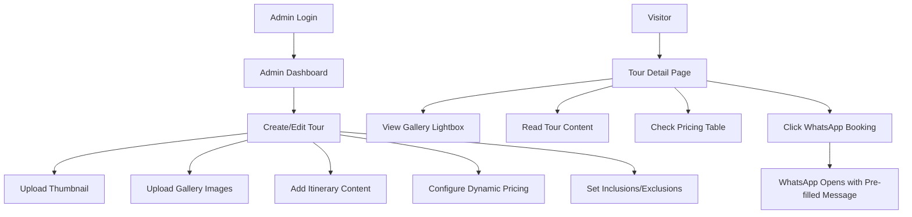

## 1. Product Overview
A luxury Bali travel agent website that showcases premium tour packages with dynamic pricing and immersive gallery experiences. The platform serves travel agents and tourists seeking high-end Bali experiences with seamless booking via WhatsApp.

Target market: Luxury travel market focusing on premium Bali tour experiences for international travelers.

## 2. Core Features

### 2.1 User Roles
| Role | Registration Method | Core Permissions |
|------|---------------------|------------------|
| Admin | Supabase authentication | Full CRUD access to tours, pricing, galleries |
| Visitor | No registration required | Browse tours, view galleries, WhatsApp booking |

### 2.2 Feature Module
Our luxury Bali travel website consists of the following main pages:
1. **Tour Detail Page**: Hero gallery with lightbox, tour overview, itinerary content, pricing table, WhatsApp booking
2. **Admin Dashboard**: Secure tour management with dynamic pricing, gallery uploads, and content editing

### 2.3 Page Details
| Page Name | Module Name | Feature description |
|-----------|-------------|---------------------|
| Tour Detail Page | Hero Gallery | Display main thumbnail with click-to-open lightbox showing full gallery from tour_gallery table |
| Tour Detail Page | Tour Content | Show description and itinerary_content with clean typography and proper formatting |
| Tour Detail Page | Inclusions List | Display included/excluded items with green checkmarks and red crosses |
| Tour Detail Page | Pricing Sidebar | Sticky sidebar showing dynamic pricing table from tour_prices with IDR/USD options |
| Tour Detail Page | WhatsApp CTA | Button that opens WhatsApp with pre-filled tour title and booking message |
| Admin Dashboard | Authentication | Secure login system protecting admin-only functionality |
| Admin Dashboard | Tour Management Form | Create/edit tours with title, location, duration, thumbnail upload |
| Admin Dashboard | Gallery Upload | Dropzone for multiple gallery images uploaded to Supabase Storage |
| Admin Dashboard | Dynamic Pricing | Add unlimited price rows with labels (e.g., "2-3 Pax") and prices |
| Admin Dashboard | Inclusions Editor | Dynamic list to add include/exclude items with boolean toggle |

## 3. Core Process

### Visitor Flow
1. User lands on tour detail page via direct link or navigation
2. Views hero image and clicks to open full gallery lightbox
3. Reads tour overview and itinerary content
4. Reviews inclusions and exclusions list
5. Checks pricing table in sticky sidebar
6. Clicks WhatsApp button to initiate booking
7. Pre-filled message opens in WhatsApp for direct communication

### Admin Flow
1. Admin logs in via secure authentication
2. Accesses tour management dashboard
3. Creates new tour with basic information
4. Uploads main thumbnail image
5. Adds multiple gallery images via dropzone
6. Writes free-form itinerary content
7. Adds dynamic pricing rows with labels and prices
8. Configures inclusions/exclusions list
9. Publishes tour for public viewing

## 4. User Interface Design

### 4.1 Design Style
- **Primary Colors**: Emerald Green (#10B981), Earthy Gold (#D4AF37), Clean White (#FFFFFF)
- **Button Style**: Rounded corners with subtle shadows, hover effects with color transitions
- **Typography**: Modern sans-serif fonts, 16px base size with responsive scaling
- **Layout Style**: Card-based design with generous spacing, sticky sidebar for pricing
- **Icons**: Lucide React icons with consistent stroke width and luxury styling

### 4.2 Page Design Overview
| Page Name | Module Name | UI Elements |
|-----------|-------------|-------------|
| Tour Detail Page | Hero Gallery | Full-width hero image with overlay text, click-to-expand lightbox with navigation arrows |
| Tour Detail Page | Content Area | Two-column layout: main content left (70%), sticky sidebar right (30%) |
| Tour Detail Page | Pricing Table | Clean HTML table with alternating row colors, IDR/USD price display |
| Tour Detail Page | WhatsApp CTA | Prominent green button with WhatsApp icon, fixed position on mobile |
| Admin Dashboard | Tour Form | Card-based form sections with clear visual hierarchy and drag-drop upload zones |
| Admin Dashboard | Dynamic Lists | Add/remove buttons with smooth animations, inline editing capabilities |

### 4.3 Responsiveness
- **Desktop-first approach** with mobile optimization
- **Mobile breakpoints**: Pricing table converts to card layout, sidebar becomes full-width
- **Touch interactions**: Swipeable gallery, large tap targets for buttons
- **Performance**: Lazy loading for gallery images, optimized image sizes